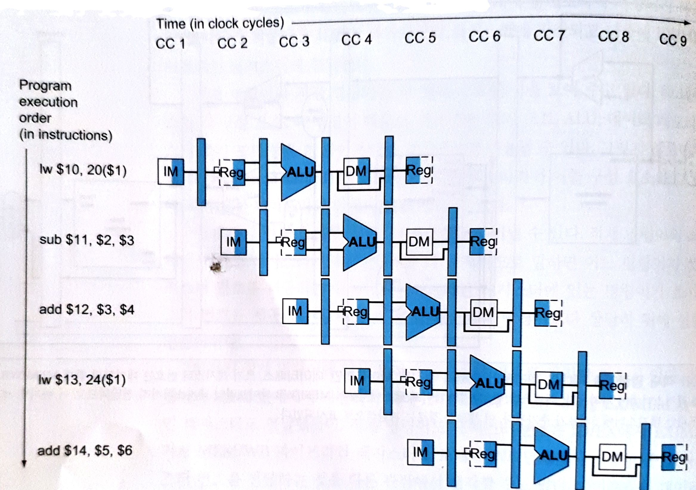

# 프로세서

## Contents

1. [서론][link1]
2. [논리 설계 관례][link2]
3. [데이터패스 만들기][link3]
4. [단순한 구현][link4]

## 1. 서론

* 프로세서가 어떻게 구현되어 있는지 공부해 봅시다!
* <details><summary>공부 순서는??</summary>

  - 간단 버전 부터 봅니다 -> MIPS 명령어 집합 구현에 충분한 프로세서 구현 방법
    - 모든 mips 명령어 구현은 X (부동소수점 명령어는 아예 설명 X)
    - 핵심되는 원리 설명하고 나머지는 비슷하다.
  - 그 다음 좀 더 현실적인 버전 봅시다 -> 파이프라인 MIPS 구현방법 
  - 마지막으로 복잡한 버전 -> x86 같은 좀 더 복잡한 명령어 집합 구현 방법
</details>

* 구현에 대한 개요
  - <details><summary>명령어 마다 공통적으로 처리해야 하는 일이 상당히 많이 있다.</summary>
  
    - 단순하고 규칙적인 특성으로 구현을 단순화 했다.
    - 어떤 명령어 든지 처음 두 단계는 똑 같다.
      1. PC 에 있는 주소 찾아서 메모리에서 명령어 가져오기.
      2. 명령어 읽오서 한 개 또는 두 개의 레지스터를 읽는다.
    - 점프 명령어 제외한 모든 명령어 종류가 레지스터 읽은 후에 ALU 를 사용
      - 산술/논리 명령어는 연산하기 위해서 사용
      - 분기 명령어는 비교하기 위해
    - ALU 사용 후에 명령어 실행 끝내는데 필요한 행동
      - 메모리 참조 명령어는 메모리에 접근할 것.
      - 산술/논리 명령어는 연산한 거 레지스터에 저장
      - 분기 명령어는 pc 값 변화 시켜서 명령어 이동시킨다.
  </details>
  
  - <details><summary>흐름을 제어해야 한다.</summary>
    - 기능 유닛과 control 유닛
    - 기능 유닛 다 연결해 놓으면 동시에 다른 데이터가 들어오게 된다.
    - 근원지 여러 개, 입력이 여러 개면 그 중 하나 선택해야한다.
    - multiplexor: 다수의 흐름을 하나로 제어해주는 녀석
  </details>

## 2. 논리 설계 관례

* 논리 회로 복습 시간~
* <details><summary>조합 소자, 상태 소자</summary>

  - 조합 소자: combinational element
    - 입력 값에 따라 출력 됨
    - ALU
  - 상태 소자: state element
    - 상태 갖고 있음
    - 명령어 memory, 데이터 memory, 레지스터
</details>

* <details><summary>클러킹 방법론</summary>

  - 신호를 언제 읽고 언제 쓸 것인가!
  - 엣지 구동 클러킹 (edge-triggered clocking)
  - 레지스터 내용 읽고 그 갑슬 조합회로로 보내고 같은 레지스터에 쓰는 작업 모두가 한 클럭 사이클에 일어난다.
  - 한 클럭 사이클 내에는 피드백 되지 않는다. 같은 state element 로 읽고 쓰는 거 한 클럭 사이클 내에 일어나면 안된다 -> mips 데이터패스는 레지스터 파일 두 벌 이상 필요???
</details>

## 3. 데이터패스 만들기

* 구성요소
  - <details><summary>PC, Instruction memory, Adder</summary>
  
    - pc, instruction memory => state element.
    - adder => 조합 element. 그저 들어온 data 에 4 더함 (다음 명령어 주소)
  </details>

  - <details><summary>Register file</summary>
  
    - 4개의 입력, 2개의 출력
    - 2개의 5bit 입력에 해당하는 regiser 에 저장되어 있는 데이터가 2개의 출력으로 나온다.
    - 1개의 5bit 입력 으로는 write 할 register 번호 받는다.
    - 마지막 하나의 32bit 입력으로 regiser 에 쓸 data 받는다. 쓸려면 제어 신호가 인가되어야 한다.
    - 출력은 다 32bit 로 나온다.
  </details>

  - <details><summary>ALU</summary>
    - 32bit 입력 2개 받아서 32bit 결과와 결과가 0인지 아닌지를 나타내는 1bit 로 내보낸다.

  </details>

  - data memory
  - sign extend -> shift 2 시켜서 분기 처리할 때 쓴다.

* 단일 데이터패스 만들기


## 4. 단순한 구현

* ALU 제어
* 주 제어 유닛의 설계
* 데이터패스의 동작
* 제어 유닛의 완성
* 단일 사이클 구현은 오늘날 왜 사용되지 않는가

## 5. 파이프라이닝에 대한 개관

* 개관
  - 파이프라이닝은 여러 instruction 이 중첩도어 실행되는 구현 기술.
  - 파이프라이닝은 하나의 instruction 이 처리되는 시간을 줄이는 것이 아닌 여러 instruction 이 처리되는 시간을 줄이는 것.
  - <details><summary>MIPS 명령어 실행 5단계</summary>
  
    1. 메모리에서 명령어 가져온다.
    2. 명령어를 해독하는 동시에 레지스터를 읽는다. MIPS 명령어는 형식이 규칙적이므로 읽기와 해독이 동시에 일어날 수 있다.
    3. 연산을 수행하거나 주소를 계산.
    4. 데이터 메모리에 있는 피연산자에 접근.
    5. 결과 값을 레지스터에 쓴다.
  </details>

* 단일 사이클 대 파이프라인의 성능
  - 이상적으로 대략 파이프 단계 수 만큼 성능이 향상된다.
  - 파이프 단계 중 처리 시간이 가장 긴 단계를 파이프 단계 처리 시간으로 둬야 한다.
  - <details><summary>예시</summary>
   
    - 가정
      - insturction 갯수 8개
      - 단일 instruction 처리 시간 중 가장 긴 것 800
      - 각 단계 중 가장 긴 처리 시간 200
    - 결과
      - 단일 사이클 명령어 총 처리 시간 800 x 8
      - 파이프 라이닝 처리 시간 200 x 8 + alpha
  </details>

* 파이프라이닝을 위한 명령어 집합 설계
  1. <details><summary>모든 MIPS 명령어는 같은 길이를 갖는다.</summary>
    
     - 명령어 가져오기(파이프 1단계), 가져와서 해독하기(파이프 2단계) 를 쉽게 해준다.
     - x86 명령어 집단은 명령어 길이가 다양해서 파이프라이닝 힘들다고 한다. 
  </details>

  2. <details><summary>MIPS 명령어 형식이 비슷하다 (R type, I type, J type)</summary>

     - op, rs 는 R type, I type, J type 다 위치와 크기가 똑같다.
     - 파이프 2단계에서 명령어 종류(op), 레지스터 파일 읽기(rs) 를 동시에 할 수 있다.
     - 형식 다 달랐으면 파이프 5단계가 아니라 6단계까 됐을 것이다.
  </details>

  3. <details><summary>MIPS 에서는 메모리 피연산자가 적재와 저장 명령어에서만 나타난다.</summary>

     - lw, sw 같은 애들(저장하고 적재하는 애들)에서만 메모리 피연산자가 쓰인다.
     - 만약 메모리에서 바로 연산하고 레지스터 저장하는 애들 있으면 파이프 3단계, 파이프 4단계가 주소단계, 메모리 단계, 실행 단계로 확장되야 한다.
     - 왜냐하면 메모리 계산하고 (주소 단계), 메모리에서 가져오고(메모리 단계), 연산 때리고(실행 단계)
     - x86 은 메모리에 있는 피연산자에 연산을 할 수 있어서 확장 됐다고 한다.
  </details>

  4. <details><summary>피연산자는 메모리에 정령되어 있어야 한다.</summary>

     - 데이터 전송 명령어?가 두 번의 데이터 메모리 접근 요구 X
     - 파이프 라인 단계 하나에서 프로세서와 메모리가 필요한 데이터를 주고받을 수 있다??
  </details>
   
* 파이프라인 해저드
  - <details><summary>구조적 해저드 (structural hazard)</summary>

    - 하드웨어에서 같은 클럭 사이클에 실행하기를 원하는 명령어의 조합을 지원하지 않는다.
    - 그니까 예를 들어 메모리를 쓰고 읽는 명령어 두 개가 같은 싸이클에서 돌아가게 됐을 때 같은 메모리를 참조하게 되는 경우 문제가 발생할 수 있다.
  </details>
    
  - <details><summary>데이터 해저드 (data hazard)</summary>

    - 파이프 어떤 단계가 다른 단계가 끝나기를 기다려야 하기 때문에 파이프라인이 지연되어야 히는 경우
    - 예를 들어 add 한 값을 바로 다음 sub 명령어에서 사용해야하는 경우 add 가 다 처리될 때까지 기다려야 한다.
    - 전방전달, 우회전달을 통해 같은 사이클내에서 일찍 받아오는 방법을 사용한다.
    - add 같은 경우 실행단계(EX) 에서 나온 값을 다음 사이클 sub 에서 쓸 수 있다.
      - 
    - 하지만 메모리 적재 같은 경우는 memory 적재 한 후에야 쓸 수 있어서 전방 전달을 해도 지연이 일어난다. (적재 사용 데이터 해저드)
      - 
  </details>

  - <details><summary>제어 해저드 (control hazard)</summary>

    - 다른 명령어들이 시행 중에 한 명령어의 결과 값에 기반을 둔 결정을 할 필요가 있을 때 발생.
    - 예를 들어 분기 명령어에서 다음 명령어가 뭐가 올지 그 분기 명령어의 결정에 기반을 둬야 한다.
    - 첫 번쨰로는 그 결정할 때까지 지연시키는 방법이 있다.
    - 하지만 느리다.
    - 두 번째 방법 예측.
      - 다음에 뭐 올지 예측해서 명령어를 실행시킨다.
      - 틀리면 다시 시작 
    - 세 번째 방법으로는 지연 분기.
      - 분기 결정에 관련없는 명령어부터 돌리는 방법.
  </details>

* 순차적인 명령어 스트림에 있는 명령어 간 병렬성을 추구 -> 한번에 처리되는 명령어 수를 늘림.

## 6. 파이프라인 데이터패스 및 제어

* <details><summary>개요</summary>

  * 명령어 실행 5단계
    1. IF: 명령어 인출
    2. ID: 며령어 해독 및 레지스터 파일 읽기
    3. EX: 실행 또는 주소 계산
    4. MEM: 데이터 메모리 접근
    5. WB: 쓰기

  * 명령어 실행 5단계는 데이터패스 왼쪽에서 오른쪽으로 흘러가는 것과 같다.
    - 오른쪽에서 왼쪽으로 가는 두 가지 예외가 있다.
      1. 쓰기 단계: 결과를 레지스터 파일에다 쓴다.
      2. PC의 다음 값 선정: 증가된 PC값과 MEM 단계의 분기 주소중에서 고른다.
    
  * 명령어 메모리는 다섯 단계 중 첫 번째 단계에서만 쓰이기 때문에 나머지 단계에서 명령어의 값을 유지하기 위해 각 파이프 단계 사이에 레지스터를 둔다.
    - 

  * 모든 명령어 PC 값을 증가시킨다. (분기 돼서 목적지 주소로 바꾸든 뭐든 일단은) (그럼 제어 해저드는 어떻게 처리하는거지?? 나중에 나오겠지??)
</details>

* <details><summary>적재 명령어 다섯 단계 (lw)</summary>
  
  1. IF
     - pc 저장되어 있는 값 꺼내서 메모리에서 명령어 읽고 IF/ID 파이프라인 레지스터에 저장
     - pc 값 4증가시켜서 pc에 다시 저장. 그리고 IF/ID 파이프라인 레지스터에도 저장 (나중 분기에 또 쓰일수도 있기 때문)
     - (아직 명령어 뭔지 모름)
  2. ID
     - 입력받은 레지스터 번호대로 레지스터 2개 ID/EX 파이프라인 레지스터에 저장
     - 16bit (immediate) 부분 32bit 로 확장해서 ID/EX 파이프라인 레지스터에 저장
     - PC 주소 (4증가된) 다시 ID/EX 파이프라인 레지스터에 저장
     - (아직 명령어 뭔지 모름 -> ID 까지는 모든 명령어 동일)
  3. EX
     - ID/EX 에서 받아온 regiser 1 데이터와 32bit 로 확장한 데이터를 ALU 에 넘겨서 연산해서 EX/MEM 파이프라인 레지스터에 저장
  4. MEM
     - EX/MEM 에서 받아온 레지스터 주소로 데이터 메모리를 읽어서 MEM/WB 파이프라인 레지스터에 저장
  5. WB
     - MEM/WB 파이프라인 레지스터에서 데이터를 읽어서 그 데이터를 중앙에 있는 레지스터 파일에 작성
</details>

* <details><summary>저장 명령어 다섯 단계 (sw)</summary>

  1. IF
     - 위 lw 와 동일
  2. ID
     - 위 lw 와 동일
  3. EX
     - 위 lw 와 같은 작업 진행
     - 추가로 register data 2를 EX/MEM 에 저장
  4. MEM
     - 위 lw 와 같은 작업으로 메모리 주소에 접근
     - 위 lw 는 접근해서 데이터를 읽어서 MEM/WB 에 저장했지만 여기서는 EX/MEM 에서 받아온 register 2 data 를 메모리에 저장한다.
  5. WB
     - 이미 메모리에 저장됐기 때문에 아무작업 안해도된다.
     - 하지만 다른 명령어 이미 뒤따라서 진행중이라 더 빨리 뭘 하던가 하는게 불가능.
     - 이미 다른 명령어 최고속도로 진행중이라 더 빨리 못 온다.
</details>
  
* <details><summary>파이프라인 다이어 그램</summary>

  - 다중 클럭 사이클 파이프라인 다이어그램
    - 
  - 단일 클럭 사이클 파이프라인 다이어그램
    - 다중 클럭 사이클 파이프라인 다이어그램의 시간축에 수직으로 잘랐을 때의 단면의 모습과 같다.
    - 
  - 적재 명령어만 파이프 5단계 필요하고, 점프, 분기, ALU 명령어들은 4단계면 충분
    - 그럼 나머지를 더 적은 단계 거치게 하면 더 빨라지는가?
    - 처리량은 클럭 사이클에 의해 결정되고 명령어 당 파이프단계의 수는 지연시간에 영향을 미치지 처리량에는 여향을 미치지 않기 때문에
    - 클럭 단계 당 처리 시간을 줄여야지 더 빨라진다. (명령어 처리 시간을 줄여야) (다음 명령어 실행되는 데까지의 시간을 줄여야)
    - 다음 명령어 실행되는 시간 같으면 별반 단계 줄인다고 별차이 없을 것이다.
</summary>

* <details><summary>파이프라인 제어</summary>

  - 제어선 레이블을 붙인 pipeline diagram
    - 
    - pc, 파이프라인 레지스터들을 위한 쓰기 신호 따로 없다. -> 매 클럭 사이클마다 쓰기 때문
  - 파이프 라인 단계별 제어
    1. IF
       - 제어할 것 없다.
       - pc 는 매번 쓰기 때문에 제어 필요 X
    2. ID
       - 제어할 것 X -> 매 클럭 사이클마다 같은 일이 일어나기 때문
    3. EX
       - RegDst: 레지스터 몇 번에 저장할지
       - ALUOp: ALU 연산 뭐 할지
       - ALUSrc: 레지스터에서 읽어 온 데이터랑 부호확장된 수치 중 하나를 ALU 입력으로
    4. MEM
       - Branch: 분기 시에 (brnach 제어 받고, 분기 ALU 가 0이면 분기 됨)
       - MemRead: 적재 시에
       - MemWrite: 저장 시에
    5. WB
       - MemtoReg: ALU 결과를 reg 파일에 쓸 것인가, 메모리에서 읽어온 데이터를 reg 파일에 쓸 것인가 선택
       - RegWrite: 위에서 선택된 값을 레지스터에 쓰게하는 신호
</details>

* 완성
  - 
  - 제어선은 ID 에서 만들어져서 EX 에서 출발. (ID 까지는 제어선 쓸 필요 X, 명령어 다 똑같아서)
  - 각 파이프라인 레지스터에 제어 정보를 전달해서 제어 정보를 같이 가져갈 수 있게 파이프라인 레지스터를 확장시킨다

## 7. 데이터 해저드: 전방전달 대 지연

* 다음 명령어에서 현재 명령어에서 저장한 register 의 data 를 가져다 써야 하는 경우 데이터 해저드가 발생
  - 그래서 전방전달을 통해 현재 명령어에 저장할 data 를 미리 가져다 쓰기

* Forwarding unit
  * 전방 전달을 할지 말지 어디로 할지 정하는 unit
  * <details><summary>forwading unit 에서 일어나는 일</summary>
    
    ```
    # EX 해저드 rs
    if (
      EX/MEM.RegWrite
      and EX/MEM.RegisterRd != 0
      and EX/MEM.RegisterRd == ID/EX.RegisterRs
    )
    => ForwardA = 10

    # EX 해저드 rt
    if (
      EX/MEM.RegWrite
      and EX/MEM.RegisterRd != 0
      and EX/MEM.RegisterRd == ID/EX.RegisterRt
    )
    => FOrwardB = 10

    # MEM 해저드 rs
    if (
      MEM/WB.RegWrite
      and (MEM/WB.RegisterRd != 0)
      and not(
        EX/MEM.RegWrite
        and EX/MEM.RegisterRd != 0
        and EX/MEM.RegisterRd != ID/EX.RegisterRs
      )
      and MEM/WB.RegisterRd == ID/EX.RegisterRs
    )
    => ForwardA = 01

    # MEM 해저드 rt
    if (
      MEM/WB.RegWrite
      and MEM/WB.RegisterRd != 0
      and not(
        EX/MEM.RegWrite
        and EX/MEM.RegisterRd != 0
        and EX/MEM.RegisterRd != ID/EX.RegisterRt
      )
      and MEM/WB.RegisterRd == ID/EX.RegisterRt
    )
    => ForwardB = 01
    ```
  </details>

  * <details><summary>상세 설명</summary>

    - EX 해저드
    - MEM 해저드
      - ```
        MEM/WB.RegWrite
        ```
        - register 에 저장하는 명령어만 전방 전달 한다.
        - MEM/WB.RegWrite 를 검사했다는 것은 현재 EX 를 하고 있는 명령어 전에 명령어가 저장하는 명령어였는지 검사한다는 것
      
      - ```
        MEM/WB.RegisterRd != 0
        ```

        - register 0 에는 저장을 하지 않기 때문에 예외 처리
        - MEM/WB 를 검사했다는 것은 현재 EX 를 하고 있는 명령어의 전 명령어가 어땠는지 본다는 것

      - ```
        EX/MEM.RegWrite
        and (EX/MEM.RegisterRd != 0)
        and (EX/MEM.RegisterRd != ID/EX.RegisterRs)
        ```
        - 이전 EX 해저드에서 전방전달을 했는지 안했는지 감사한다.
        - 이전 EX 해저드에서 전방전달을 한 것이 더 최신 값이기 때문에.
  </details>

* 해저드 검출 유닛
  - 전방 전달로 해결 못하는 경우 지연 시키는 unit 이다.
  - 예를 들어 적재 명령어에서 쓰기를 원하는 레지스터를 다음 명령어에서 필요로 하는 경우 전방 전달로 해결 못한다.
  - <details><summary>일어나는 일</summary>
    
    - 
      ```
        if (
          ID/EX.MemRead
          and (
            ID/EX,RegisterRt == IF/ID.RegisterRs
            or ID/EX.RegisterRt == IF/ID.RegisterRt
          )
        )
        => stall the pipeline
      ```
    - `ID/EX.MemRead`
      - EX 에 있는데 MemRead 읽고 적재 명령어 였는지 검사
    - `ID/EX.RegisterRt == IF/ID.RegisterRs(t)`
      - ID/EX.RegisterRt : 이전 적재 명령어에서 어디 레지스터에 저장할지
      - IF/ID.RegisterRs(t) : 바로 다음 명령어에서 어떤 레지스터 읽을지
  </details>

## 8. 제어 해저드

* 분기가 일어나지 않는다고 가정
  - 분기가 일어나지 않는다고 가정하고 다음 명령어 실행시키기
  - 분기가 일어났을 경우 분기가 MEM 단계에 있을 때 앞에 IF, ID, EX 단계의 제어 값을 0으로 바꾼다.
  - (적재 지연의 경우에는 ID 단계의 제어 값만을 0으로 바꿔줬었다.)
* 분기에 따른 지연 줄이기
  - 분기 되면 지연이 발생한다.
  - 그냥 지연시켜 버리면 IF, ID, EX 에 있는 세 명령어가 다 지연 되버린다.
  - 분기 주소 계산과, 분기 여부 계산을 ID 에서 해버려서 지연이 하나만 되게 한다.
  - ID 에서 레지스터 data 2개 같은지 (분기 여부 계산)
  - ID 에서 PC 와 
* 동적 분기 에측
  - 이 분기 명령어가 지난번에 실행됐을 때 분기가 일어났는지를 알아본다.
  - 분기 예측 버퍼에 최근에 분기 일어났는지 아닌지를 나타내는 비트를 가지고 있다.

[link1]: #user-content-1-서론
[link2]: #user-content-2-논리-설계-관례
[link3]: #user-content-3-데이터패스-만들기
[link4]: #user-content-4-단순한-구현
